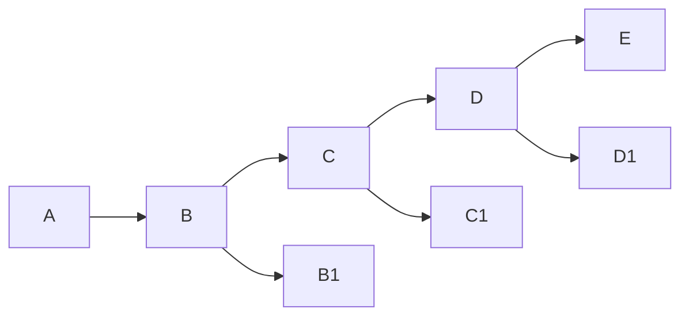
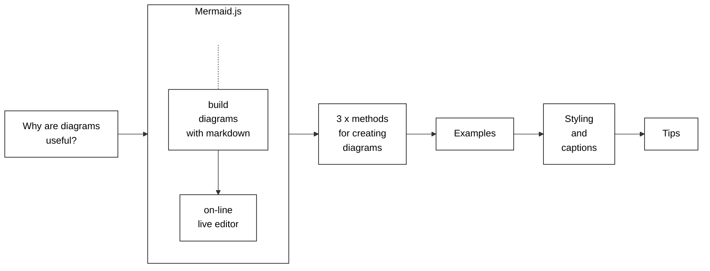

# lwdx
_This repo is a placeholder for a still-unnamed app currently under development._

Lightweight document transformations & assemblies, based on familiar markups and simple tools.
* Accept and process content authored in three interoperable input formats: XDITA _xml_, HDITA _html5_, MDITA _markdown_ (Note: this interop is a fundamental premise of LwDITA) 
* Assemble documents from _maps_ that transclude modular, structured _topics_ (this feature is straight from DITA) 
* Based on the emerging [OASIS LwD standard](https://github.com/oasis-open/dita-lightweight) (altho full compliance is _not_ guaranteed) 
* The goal is roundtrip conversions among all three formats for freedom+flexibility in authoring+publishing  
* We desire straightforward handling of XML mixed content, and therefore... 
* We take a DIY approach (based on the Go stdlib) over the horrors of Golang's [XML annotations](https://godoc.org/encoding/xml#Marshal). 
## Contains 
* CLI commands 
* Golang API
* Web UI 
## Features
* _simplex sigillum veri_
* Rely on Golang's [`encoder/xml`](https://godoc.org/encoding/xml) package for parsing & tokenization (but which fumbles with XML namespaces) 
* Hide as much XML & DITA complexity as possible (Bell Labs UNIX "NJ Style": _It is slightly better to be simple than correct._)
* Format input files opinionatedly (like `gofmt`), which simplifies diff'ing for changes under version control 
* (temporarily shelved) For purposes of comparison and exploration, can write out parse trees generated by [`xmlx`](https://github.com/jteeuwen/go-pkg-xmlx), [`etree`](https://github.com/beevik/etree), [`mxj`](https://github.com/clbanning/mxj), [`x2j`](https://github.com/clbanning/mxj/tree/master/x2j), [Go `html`](https://godoc.org/golang.org/x/net/html)
## License
* [AGPL](https://www.gnu.org/licenses/agpl-3.0.en.html)
* Note tho that subsidiary libraries under github.com/fbaube are MIT license
* [Discussion](https://drewdevault.com/2020/07/27/Anti-AGPL-propaganda.html)
* (Future:_TBS_) Dual licensing to provide an option for unencumbered commercial use 
## Missing
* Automated tests 
* XML DTD-style entity substitutions (but didn't you get the memo? yer sposta use DITA `conref`)
* Details of comment handling in Markdown, and how it can support roundtripping for complex LwDITA tags (note that LwDITA relies on CommonMark with extensions) 
## TODOs & Roadmap
* Implement character entities, partly to enhance the input parser comparisons 
* Publishing! (this is the first step to usefulness, and will be done along the lines of the DITA-OT's preprocessing stage) 
* A schema-driven WYSIWYG IBE (in-browser editor, probably [Quill](https://quilljs.com/) 
* Enhanced support for common DITA mechanisms like conref files and glossary files 
* Support for LwDITA-style specialization-by-example 
* _Not_ roadmapped yet: Support for `ditaval` files for conditional publishing 
## Contributing
* Contact me at fbaube at iki daaht fi 

## mermaid test

